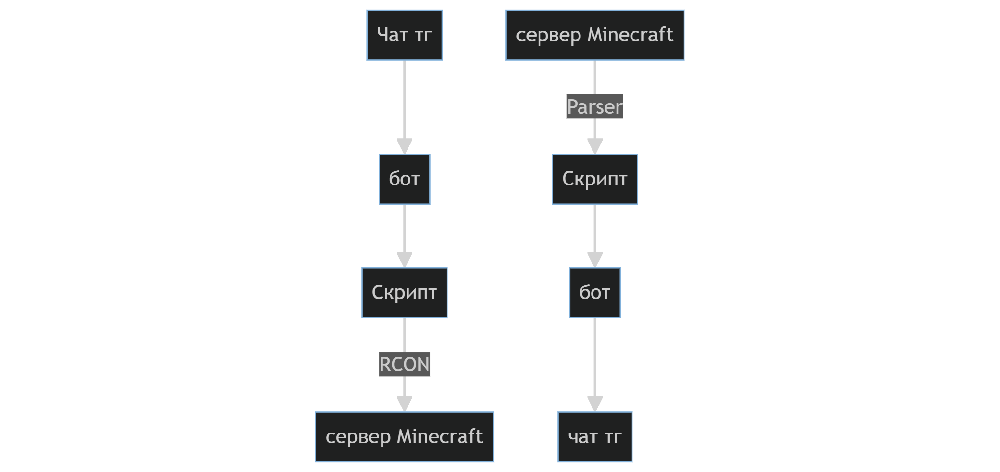

# Проект по синхронизации чата в тг и чата на сервере в майнкрафте
## Схема работы:
Необходимо написать двустороннюю связь:

**Telegram -> Minecraft**

**Minecraft -> Telegram**
### Первая часть
Скрипт получает сообщение от бота, а после отправляет его на сервер через RCON
### Вторая часть
Скрипт читает логи сервера, из них выцепляет сообщения чата и отправляет их в API Telegram.
### Связь действий:
Асинхронка Event loop



## Примерная структура проекта:
```
mc_tg_chat_sync/
├── main.py
├── check.py
├── services/
│   ├── __init__.py
│   ├── telegram_bot.py     # Логика бота
│   ├── mc_log_reader.py    # (Minecraft -> Python)
│   └── mc_rcon.py          # (Python -> Minecraft)
└── utils/
    ├── __init__.py
    └── db.py               # КЛИКХАУС
```
## Что будут видеть пользователи:
**Синхронные чаты в Minecraft и в Telegram:** при написании сообщения в одном чате оно сразу же будет появляться в другом.

Также будет добавлен ClickHouse для хранения логов чата, сохранения id группы из телеграма и настроек пользователей
## Итоговый список задач и распределение:
Работа с API Telegram: Дарчиев Александр

Бот для Telegram: Дарчиев Александр

Работа с выводом сообщений из minecraft: Шумилов Михаил

Парсер: Шумилов Михаил

Написание тестов работы ClickHouse: Шумилов Михаил

Работа с вводом сообщений в minecraft: Потапенко Степан

ClickHouse: Потапенко Степан

Сборка всего вместе и дебаг: Потапенко Степан

## Тестировка:

Тестировка и дебаг: Потапенко Степан

В качестве тестировки будет создана группа в тг, к которой подключится бот. Также будет запущен и локальный сервер в Minecraft, к которому подключится данная утилита.

В качестве самых обычных тестов будут отправлены сообщения в группу в тг и в чат в minecraft.

В качестве стресс-тестов будет найдена оптимальная длина разделения по символам слишком длинного сообщения из тг в чате minecraft.

Также для удобной проверки записи логов будет добавлен отдельный файл, при запуске которого в консоль выводятся логи. Это поможет не только удобно тестировать ClickHouse, но также является удобным способом отсматривать логи чата.

Тестировать подключение группы к скрипту и синхронизированность пользователей достаточно просто. Надо просто перезапустить скрипт, и если они остались, то все работает.